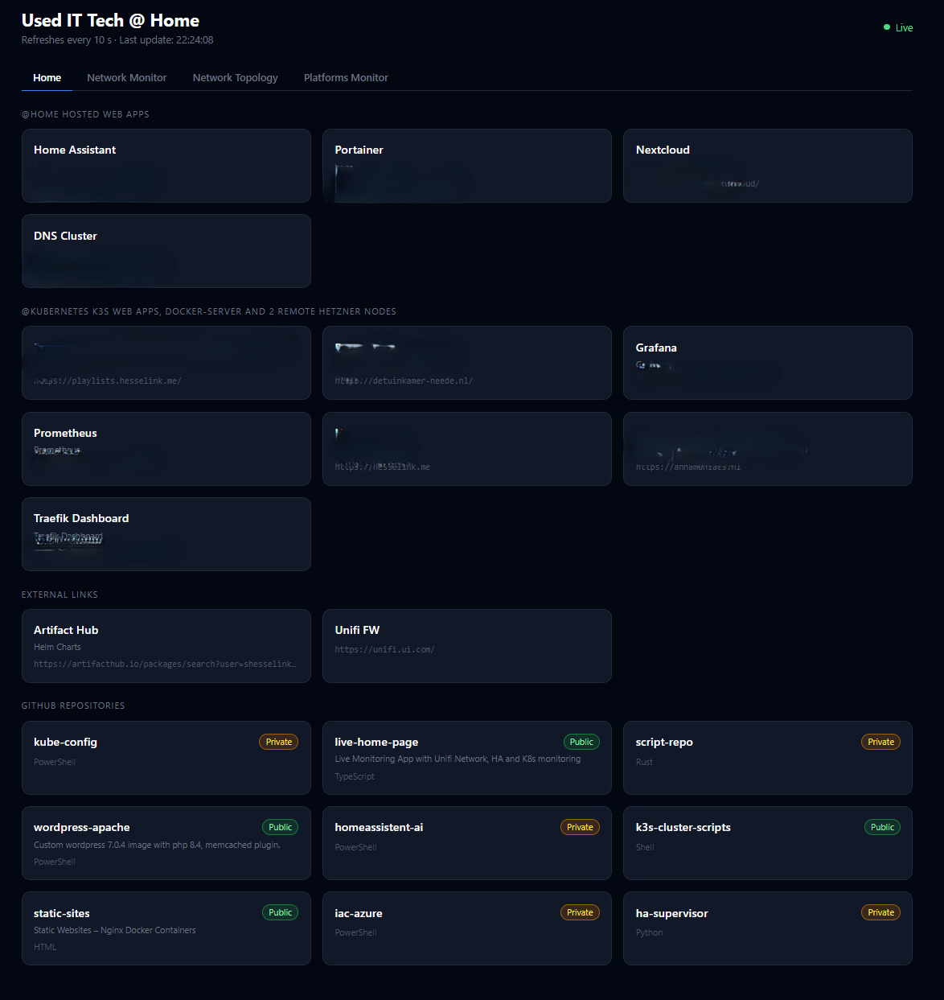
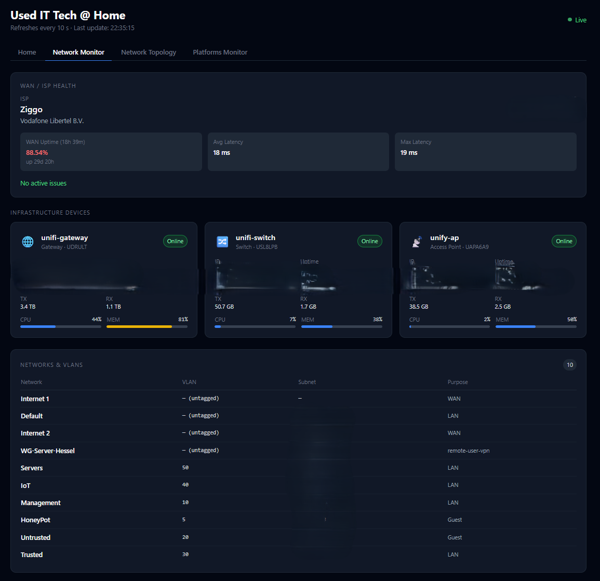
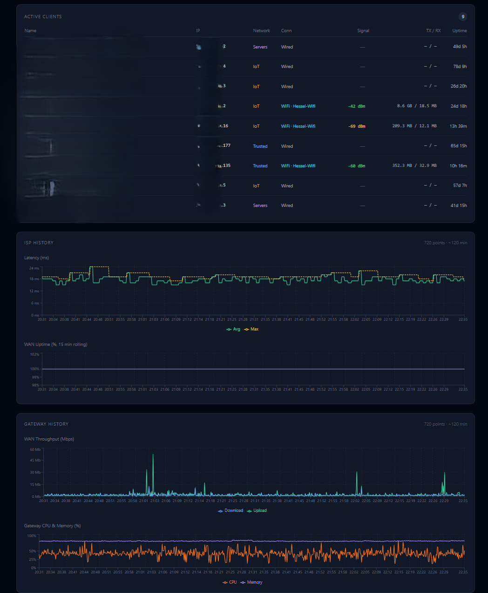
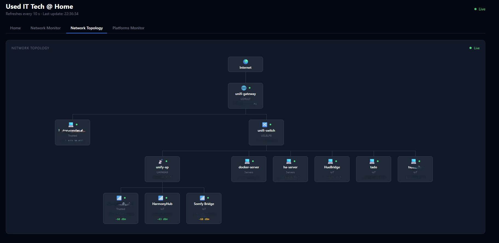
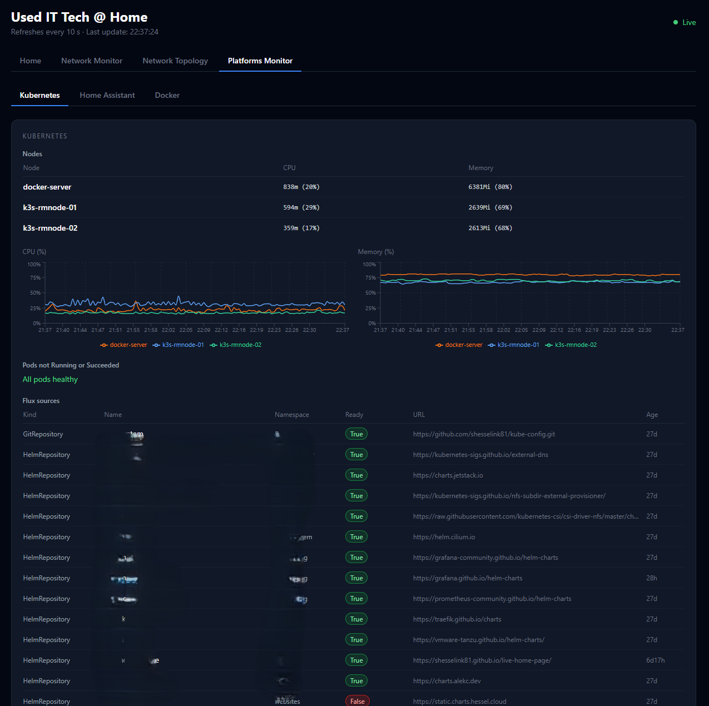
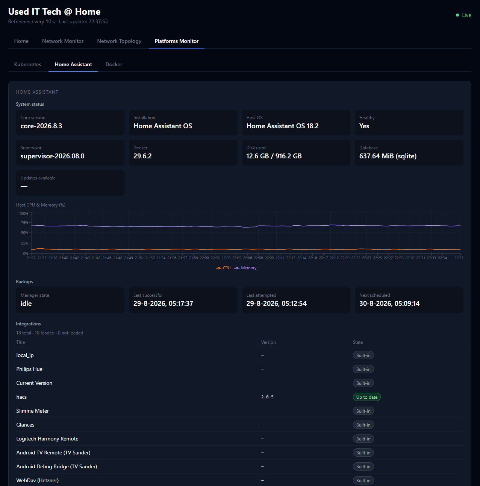
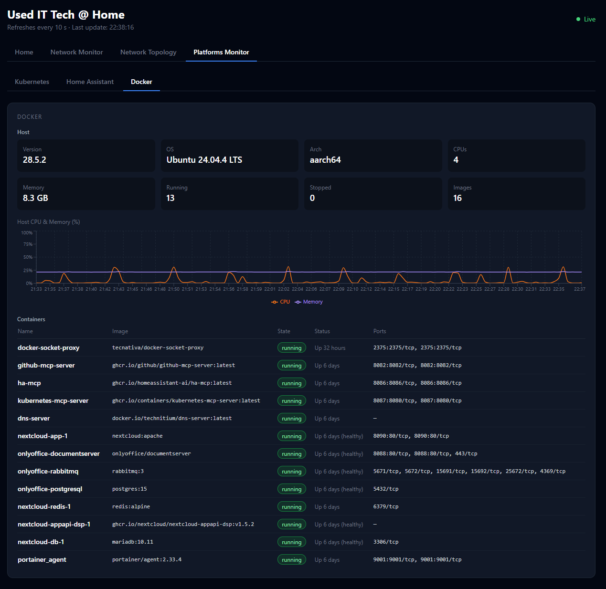

# live-home-page

Live Monitoring App with Unifi Network, HA and K8s monitoring

[**→ Screenshots**](#screenshots)

## What's inside

| Component | Description | Port |
|-----------|-------------|------|
| **monitor** | Next.js dashboard (UniFi health, live Kubernetes/Docker/GitHub/Home Assistant data, optional SSO) | 4000 |
| **backend** | Polls ISP/Kubernetes/Home Assistant/Docker on its own timers — independent of any open browser tab — and persists history to MariaDB. Internal-only, never exposed outside the compose/cluster network | 4100 (internal) |
| **db** | MariaDB storing the backend's metric/chart history, so it survives restarts and redeploys. Internal-only | 3306 (internal) |

## Features

Four auto-refreshing tabs, all in one single-page dashboard:

### Home

- Quick-launch tiles for your own links, grouped by title, fully configurable via env vars (no rebuild needed) — see [Installation step 4](#4-optional-home-tab-links)
- A live GitHub repositories list (pulled through `github-mcp-server`)

### Network Monitor (Unifi)

- WAN/ISP health — ISP name, uptime %, latency, active issues
- Infrastructure devices — gateway/switch/AP status, firmware, TX/RX, CPU + memory usage bars
- Active clients — name, IP, VLAN, connection type, signal, TX/RX
- ISP history charts — latency (avg + rolling max) and WAN uptime over the last ~2 hours
- Gateway history charts — WAN upload/download throughput and gateway CPU/memory % over the last ~2 hours

### Network Topology (Unifi)

Live tree view: Internet → gateway → switches/APs → clients.

### Platforms Monitor

Three sub-tabs — Kubernetes, Home Assistant, Docker — each pulling live data through the **backend** service (see [Installation step 3](#3-optional-live-platforms-monitor-tab)), independently of any browser tab being open. Every source degrades independently to "not reachable" if its upstream isn't configured or reachable — the rest of the tab keeps working. History is persisted to MariaDB, so charts survive a container restart or redeploy instead of resetting to empty.

- **Kubernetes** — node CPU/memory table *and* rolling charts, pods not in a healthy state, Flux sources (`GitRepository`/`HelmRepository`), Flux Helm releases with parsed chart/version and Ready status
- **Home Assistant** — system status (Core/OS/Supervisor/Docker versions, disk usage, pending updates) with a rolling CPU/memory chart for the host, backup status (manager state, last/next scheduled backup), your self-installed integrations (version + up-to-date status, cross-referenced against HACS), installed HACS plugins, and Supervisor add-ons (HAOS/Supervised installs only)
- **Docker** — host info (version, OS, CPU count, memory) with a rolling host CPU/memory chart, and a live container table (name, image, state, uptime, ports) for a Docker host. Read through a `docker-socket-proxy` (Tecnativa) — the backend never talks to the Docker socket directly

### Cross-cutting

- **Optional network access control** — the whole app (pages + API) can be restricted to `ALLOWED_NETWORKS` (comma-separated CIDRs). Unset/empty = the IP check is disabled entirely (rely on SSO/`DASHBOARD_TOKEN`/a reverse proxy instead). Application-level defense-in-depth, not a substitute for a real ingress-level allowlist in production.
- **Optional Microsoft Entra ID SSO** — layers *on top of* the network restriction above (both must pass, not either/or). Fully optional: disabled entirely unless all three `AUTH_MICROSOFT_ENTRA_ID_*` values are set. Restrict sign-in to specific accounts with `AUTH_ALLOWED_EMAILS`. JWT/in-memory sessions only — no database. See [Installation step 5](#5-optional-microsoft-entra-id-sso).
- **Optional `DASHBOARD_TOKEN`** — bearer-token protection for `/api/*`, independent of SSO (meant for scripts/automation, not browser use). Still works as a bypass for API callers even when SSO is enabled.
- **Customizable branding** — `APP_TITLE` overrides the dashboard header and browser tab title (default: "Used IT Tech @ Home").
- **Persistent history** — ISP/gateway and Platforms Monitor chart history is stored in MariaDB by the **backend** service, surviving container restarts and redeploys instead of resetting to empty.

## Requirements

- Docker with Compose v2
- A UniFi console/controller reachable on your network
- A UniFi local API key (optionally also a cloud API key, for `api.ui.com` metrics)

## Installation (Docker Compose)

### 1. Clone and configure

```sh
git clone https://github.com/shesselink81/live-home-page.git
cd live-home-page
cp .env.example .env
```

Fill in your values in `.env`:

```env
UNIFI_CLOUD_API_KEY=your-cloud-api-key
UNIFI_LOCAL_API_KEY=your-local-api-key
UNIFI_LOCAL_IP=local-ip-of-unifi-controller
DB_PASSWORD=a-strong-password
```

> Local API key: UniFi console → Settings → Control Plane → Integrations
> Cloud API key: [unifi.ui.com](https://unifi.ui.com) → Settings → Control Plane → Integrations
> `DB_PASSWORD` secures the bundled MariaDB storing chart/metric history (see `db` in [What's inside](#whats-inside)) — `.env.example` ships a `change-me` placeholder, always replace it.

### 2. Optional: restrict access by network

By default the app accepts requests from anywhere — set `ALLOWED_NETWORKS` to restrict it to specific CIDRs (rely on SSO/`DASHBOARD_TOKEN`/a reverse proxy instead if you'd rather leave this unset):

```env
ALLOWED_NETWORKS=192.168.1.0/24
```

Browsing to it from the same machine that's running Docker Desktop? Also add `172.16.0.0/12` — Docker's own bridge-network range. Published-port traffic arrives at the container looking like it came from Docker's gateway, not `localhost`:

```env
ALLOWED_NETWORKS=192.168.1.0/24,172.16.0.0/12
```

### 3. Optional: live Platforms Monitor tab

The Platforms Monitor tab can show live Kubernetes, Home Assistant, and Docker data (plus GitHub on the Home tab), each read by the **backend** service from its own upstream — see [`docker-compose.mcp.yaml`](./docker-compose.mcp.yaml) (meant to run as a dedicated stack, e.g. on a separate docker host) for `kubernetes-mcp-server`, `ha-mcp`, `github-mcp-server`, and `docker-socket-proxy`. Point the app at them:

```env
MCP_HOST=host.docker.internal
MCP_GITHUB_TOKEN=your-github-pat
HOMEASSISTANT_URL=https://your-home-assistant-url
HOMEASSISTANT_TOKEN=your-home-assistant-long-lived-token
KUBECONFIG_PATH=./kubeconfig
```

`MCP_HOST` is used to build `MCP_KUBERNETES_URL`/`MCP_GITHUB_URL`/`MCP_HOMEASSISTANT_URL`/`DOCKER_API_URL` automatically; set any of them individually only if that source lives somewhere other than `MCP_HOST`. The Docker section talks to the Docker Engine remote API through `docker-socket-proxy` (Tecnativa, also defined in `docker-compose.mcp.yaml`) rather than the Docker socket directly — `DOCKER_API_URL` should point at that proxy's `tcp://host:port`, not at Docker itself. Everything else in the app works fine without any of this — the tab just shows "not reachable" per source until it's configured.

### 4. Optional: Home tab links

The dashboard's Home tab shows no links by default. Add your own:

```env
HOME_LINK_0_TITLE=My links
HOME_LINK_0_LABEL=Google
HOME_LINK_0_URL=https://google.com
HOME_LINK_0_NOTE=Search
```

Add more with `HOME_LINK_1_*`, `HOME_LINK_2_*`, etc. Entries sharing the same `TITLE` are grouped together on the tab.

### 5. Optional: Microsoft Entra ID SSO

Gate the whole app behind Microsoft sign-in, on top of the network restriction from step 2. Register an app in the Entra admin center (redirect URI: `<your-app-url>/api/auth/callback/microsoft-entra-id`) and set:

```env
AUTH_MICROSOFT_ENTRA_ID_ID=your-app-registration-client-id
AUTH_MICROSOFT_ENTRA_ID_SECRET=your-app-registration-client-secret
AUTH_MICROSOFT_ENTRA_ID_ISSUER=https://login.microsoftonline.com/your-tenant-id/v2.0
AUTH_SECRET=generate-a-random-value
AUTH_ALLOWED_EMAILS=you@example.com
```

> Generate `AUTH_SECRET` with: `node -e "console.log(require('crypto').randomBytes(32).toString('base64'))"`

Leave any of the three `AUTH_MICROSOFT_ENTRA_ID_*` values unset to keep SSO fully disabled — the app then behaves exactly as if this section didn't exist. `AUTH_ALLOWED_EMAILS` is optional too; leave it empty to allow any account in the tenant.

### 6. Run

```sh
## Start MCP Servers local
docker compose -f docker-compose.mcp.yaml up -d
docker compose up -d
```

Open **http://localhost:4000**.

For local development with hot-reload instead:

```sh
docker compose -f docker-compose.dev.yaml up -d
```

See `.env.example` for the full list of options, including `DASHBOARD_TOKEN` (bearer-token protection for `/api/*`) and `APP_TITLE` (rename the dashboard).

## MCP servers (for Claude Code)

Configured in `.mcp.json` (see `.mcp.json.example` for a template). Enable via `/mcp` in Claude Code.

| Server | Type | Purpose |
|--------|------|---------|
| `unifi Local` | stdio | UniFi local-controller tools — devices, clients, firewall, DNS, WiFi, … |
| `unifi Cloud` | stdio | UniFi cloud API tools — `get_isp_metrics`, `list_sites`, `get_site_health_summary` |
| `Home Assistant` | http | Home Assistant tools — same server the Platforms Monitor tab uses |
| `kubernetes` | http | Kubernetes cluster tools — same server the Platforms Monitor tab uses |
| `github` | http | GitHub repository tools — same server the Home tab uses |

## Helm repository

Hosted via GitHub Pages. Add the repo and install:

```sh
helm repo add live-home-page https://shesselink81.github.io/live-home-page
helm repo update
helm install live-home-page live-home-page/live-home-page \
  --set unifi.localIp=192.168.1.1 \
  --set unifi.localApiKey=YOUR_LOCAL_KEY \
  --set unifi.cloudApiKey=YOUR_CLOUD_KEY \
  --set db.password=YOUR_DB_PASSWORD
```

## Kubernetes (Helm)

The chart lives in `helm/live-home-page/` and deploys all three components from [What's inside](#whats-inside) — `monitor`, `backend`, and a bundled single-replica `db` (MariaDB) — as one release. `db.password` is required (Helm fails fast with a clear error if it's left unset, rather than the db pod crash-looping on a missing secret key):

```sh
helm install live-home-page ./helm/live-home-page \
  --set unifi.localIp=192.168.1.1 \
  --set unifi.localApiKey=YOUR_LOCAL_KEY \
  --set unifi.cloudApiKey=YOUR_CLOUD_KEY \
  --set db.password=YOUR_DB_PASSWORD
```

Set `db.enabled=false` and `db.host=...` to point at an external MariaDB/MySQL server instead of the bundled one — see `helm/live-home-page/README.md` for details.

Then port-forward or enable an Ingress:

```sh
# Quick access
kubectl port-forward svc/live-home-page 4000:4000

# Ingress (nginx example)
helm upgrade live-home-page ./helm/live-home-page \
  --set ingress.enabled=true \
  --set ingress.className=nginx \
  --set ingress.hosts[0].host=unifi.example.com \
  --set ingress.hosts[0].paths[0].path=/ \
  --set ingress.hosts[0].paths[0].pathType=Prefix
```

Use an HTTPRoute (Gateway API) instead of Ingress:

```sh
helm upgrade live-home-page ./helm/live-home-page \
  --set httpRoute.enabled=true \
  --set httpRoute.parentRefs[0].name=my-gateway \
  --set httpRoute.parentRefs[0].namespace=gateway \
  --set httpRoute.parentRefs[0].sectionName=https \
  --set httpRoute.hostnames[0]=unifi.example.com
```

Use `existingSecret` to supply API keys from a pre-created Secret (keys: `local-api-key`, `cloud-api-key`, `db-password`, plus `dashboard-token`/`mcp-github-token`/`sso-client-secret`/`sso-auth-secret` for the optional features above).

The chart mirrors every env var described in this README as a `values.yaml` field — see the comments in `helm/live-home-page/values.yaml` for the full list (`appTitle`, `mcp.*`, `backend.*`, `db.*`, `network.allowedNetworks`, `homeLinks.links`, `sso.*`). It can also attach existing Traefik `Middleware` CRDs to the exposed route via `traefik.middlewares` — see [Attaching Traefik middleware](./helm/live-home-page/README.md#attaching-traefik-middleware) in the chart README.

## Project structure

```
.
├── app/                     # Next.js frontend
│   ├── src/
│   │   ├── app/api/         # API routes — UniFi/GitHub direct, ISP/Kubernetes/Home Assistant/Docker proxy to backend
│   │   ├── components/      # Dashboard UI components
│   │   └── lib/             # UniFi API client, MCP client (GitHub), backend proxy fetcher, formatters
│   ├── Dockerfile           # Production image (multi-stage, standalone build)
│   ├── Dockerfile.dev       # Dev image (hot-reload)
│   └── .env.local           # Local env for running app/ directly, not via Docker (not committed)
├── backend/                 # Polling + history service — ISP/Kubernetes/Home Assistant/Docker, MariaDB-backed
│   └── src/
│       ├── collectors/      # One fetch-and-persist function per source
│       ├── poller.ts        # Timers driving the collectors independently of any browser tab
│       └── server.ts        # Express — serves the latest cached snapshot + history to the frontend
├── helm/live-home-page/     # Helm chart for Kubernetes (monitor + backend + db)
├── screenshots/             # Dashboard screenshots used in this README
├── docker-compose.yaml      # monitor + backend + db, production
├── docker-compose.dev.yaml  # monitor + backend + db, dev with hot-reload
├── docker-compose.mcp.yaml  # Optional: MCP servers + docker-socket-proxy for the Platforms Monitor tab
├── .mcp.json                # Claude Code MCP config (not committed)
├── .env.example             # Template — copy to .env and fill in
└── .env                     # API keys and config (not committed)
```

## Screenshots

<div align="left">


<p><sub>Home</sub></p>


<p><sub>Network Monitor — WAN health, devices, clients</sub></p>


<p><sub>Network Monitor — ISP & gateway history charts</sub></p>


<p><sub>Network Topology</sub></p>


<p><sub>Platforms Monitor — Kubernetes</sub></p>


<p><sub>Platforms Monitor — Home Assistant</sub></p>


<p><sub>Platforms Monitor — Docker</sub></p>

</div>